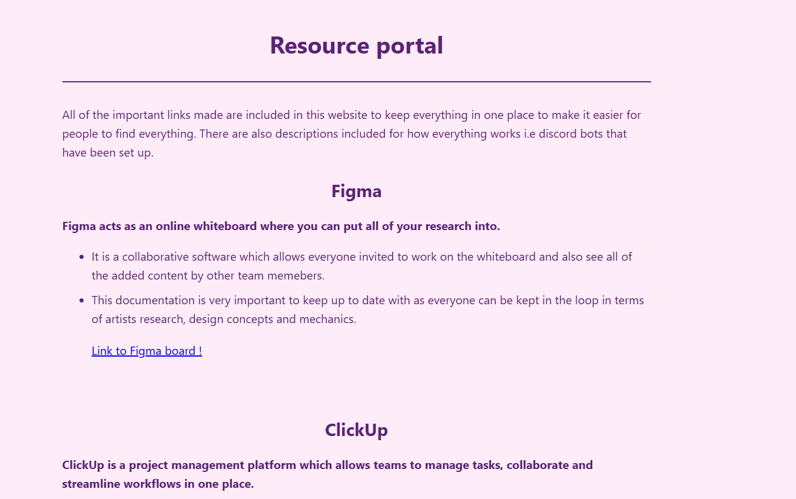
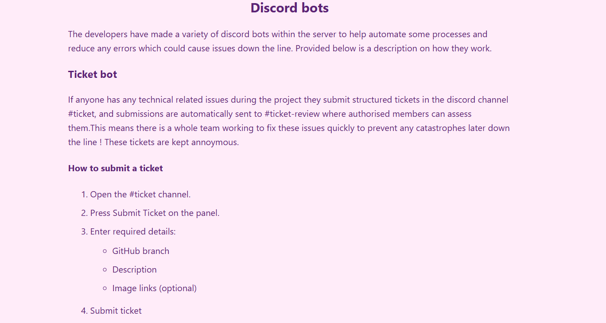
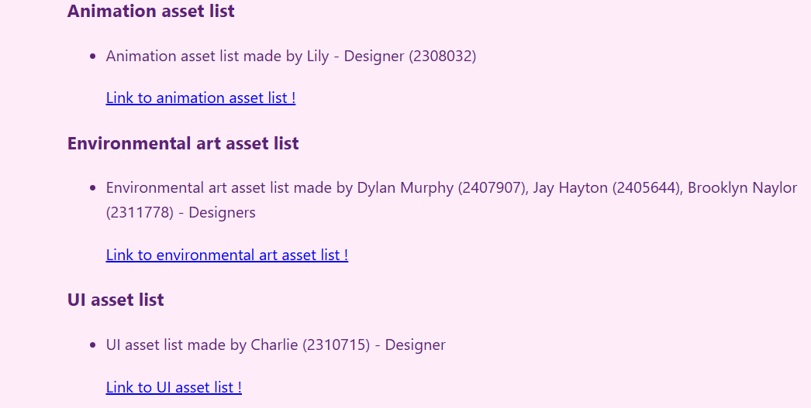
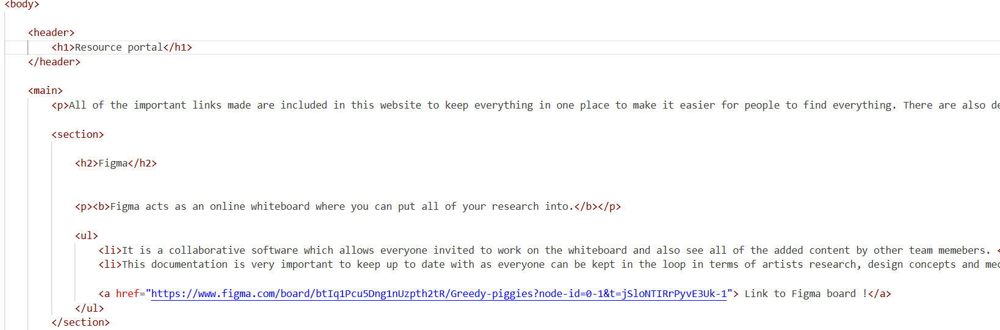
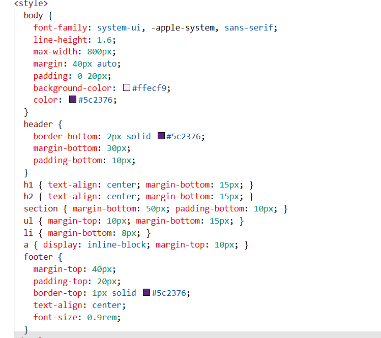

# Resource portal 

---

## 1. Introduction (120 words)

I created a resource portal to organise all of the important links that had been shared in our group Discord as the constant flow of messages was becoming overwhelming and made it difficult for people to find what they needed. 

***Figure 1.** overview of the resource portal*

After researching GitHub Pages (Quickstart for GitHub Pages, s.d.) and how to create a personalised index.html location (How to Configure GitHub Pages to Use a Custom index.html Location, 2025), I built a simple website that centralised these links and included explanations of the Discord bots so team members could use them correctly and consistently. 

***Figure 2.** Discord bot explanation section*

I also listed who created each linked document, giving everyone a clear point of contact for questions or concerns and improving accountability across the team.
 
 
 ***Figure 3.** Point of contact for each document made*

The portal was designed to support clearer collaboration, reduce confusion or miscommunication, and improve workflow efficiency by providing structured documentation that aligns with professional production practices.

## 2. Implementation (177 words)

For the GitHub Pages resource portal, I built a static website using HTML and CSS because they are languages I am familiar with and they suit a lightweight documentation site.

 I structured the page using semantic elements like `<header>`, `<main>`, `<section>`, and `<footer>` to keep the content organised, with each resource (Figma, ClickUp, GDD, asset lists, artist documents, and Discord bots) separated into its own `<section>` and linked using `<a>` tags. 

***Figure 4.** Code snippet of HTML used*

For presentation, I applied CSS directly in the `<style>` block to control typography, colours, spacing, and readability, including centred headings (`h1`, `h2`) and consistent gaps between sections using `section { margin-bottom: 50px; }`. 

***Figure 5.** Code snippet of CSS used*

I also used ordered lists (HTML Ordered Lists, s.d.) (`<ol>`) and unordered lists (`<ul>`) to format step-by-step instructions for the ticket bot and asset drop-off bot so the guidance was easy to follow. 

A key challenge was making sure layout and styling changes displayed correctly on the deployed site, which required checking the GitHub Pages deployment workflow and refreshing cached pages to confirm updates. The site demonstrates a clear, maintainable structure for sharing project documentation in a professional workflow.

---

## 3. Outcome (149 words)

The final result is a fully functional GitHub Pages website that acts as a centralised resource hub for the project, providing access to all key documents such as asset lists and Discord bot guidance.

 The site behaves as a clear documentation page, with organised sections, consistent formatting, and direct hyperlinks that allow users to quickly navigate to external platforms such as Figma, ClickUp, Google Docs, and SharePoint. The layout ensures readability through centred headings, spacing between sections, and structured lists for step-by-step bot instructions, making the information accessible and easy to follow.
 
  All original task requirements have been met: the portal consolidates previously scattered links, explains how automation tools (such as the ticket and asset drop-off bots) function, and clearly identifies document owners to improve accountability. The demonstrated functionality shows that the website successfully improves organisation, reduces confusion, and supports a more efficient collaborative workflow within the production pipeline.

**Demonstration video link:**  

---

## 4. Bibliography

Quickstart for GitHub Pages (s.d.) At: https://docs-internal.github.com/en/pages/quickstart (Accessed  13/02/2026). 

How to Configure GitHub Pages to Use a Custom index.html Location (2025) Directed by vlogize. At: https://www.youtube.com/watch?v=ZlMWwDpMjms (Accessed  13/02/2026).

HTML Ordered Lists (s.d.) At: https://www.w3schools.com/html/html_lists_ordered.asp (Accessed  13/02/2026).

---

## 5. AI Usage Declaration

ChatGPT was used to help write this document. 

---

