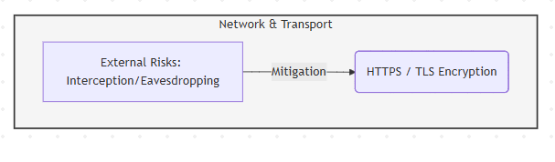
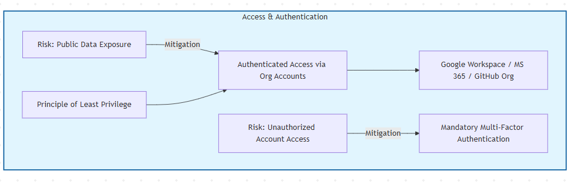
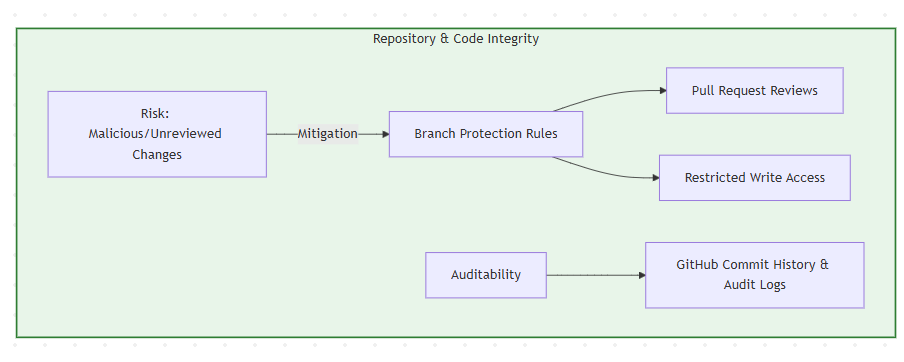
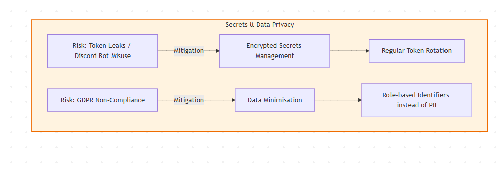

# Evaluating a tool from a networking, security and complicance perspective.

---

## 1. Introduction (180 words)

I chose to evaluate my resource portal because I made it myself for this project using GitHub Pages, HTML, and CSS. Hosting it on GitHub Pages means it is accessed over a network through a browser, so even though it is a static site it still introduces security and compliance considerations. Since it transmits data over HTTPS, the site relies on secure network protocols to protect content in transit. However, the main risk is accidental exposure of internal project information if any linked documents are set to public access or shared using “anyone with the link” permissions (Silberman, s.d.). This represents a misconfiguration risk and could result in unintended data leakage.

There is also an integrity risk. If an internal team member misuses permissions or an external attacker gains access through compromised credentials, the repository could be edited to replace legitimate links with phishing pages or malicious files. This could lead to credential theft, malware downloads, or unauthorised sharing of sensitive project data (About protected branches, s.d.). Since the portal acts as a gateway to project resources, access control and change protection are essential.

## 2. Implementation (206 words)

From a networking perspective, GitHub Pages provides a secure baseline because it serves content over HTTPS, which operates over TCP with TLS encryption to ensure confidentiality and integrity during transmission (Securing your GitHub Pages site with HTTPS, s.d.). This mitigates interception risks but does not address access control or misuse.

To reduce data exposure, the portal should only link to documents that require authenticated access through managed organisational accounts (e.g., Google Workspace, Microsoft 365, or GitHub organisation access) rather than public link sharing. Permissions should follow the principle of least privilege, ensuring only authorised team members can view or edit documentation.

At the repository level, mitigation measures include enforcing multi-factor authentication for contributors (Authentication documentation, s.d.), restricting write access, enabling branch protection rules, and requiring pull request reviews. These controls reduce the likelihood of unauthorised or unreviewed changes.

If Discord bots are referenced, their tokens must never be stored in the repository or exposed client-side. Instead, they should be managed as encrypted secrets, rotated periodically, and assigned minimal required permissions (OWASP, s.d.). Logging and auditing through GitHub commit history and audit logs support traceability and incident response. 

Finally, GDPR data minimisation principles should be followed by limiting personal contact details and using role-based identifiers where possible.

---

## 3. Outcome (111 words)

Overall, the portal remains relatively low risk because it is static and does not process player data directly. The primary risks relate to misconfiguration, internal misuse, and repository compromise rather than complex network exploitation. Introducing additional networking features such as centralised validation services, shared dashboards, or version control integration could improve visibility and ensure documents are always up to date. A dedicated authoritative backend could increase trust by validating resources dynamically. However, moving to a client–server model would increase infrastructure complexity, maintenance requirements, and the overall attack surface. For this project’s scale, maintaining a lightweight HTTPS-based portal with strong access controls provides the best balance between usability, security, and operational simplicity.

**Demonstration video link:**  

---

## 4. Bibliography

Silberman, J. (s.d.) Sharing Files with Everyone - Risky Google Drive Misconfiguration | Valence Security. At: https://www.valencesecurity.com/resources/ the-danger-of-sharing-files-with-anyone-with-the-link-examining-a-risky-google-drive-misconfiguration (Accessed  22/02/2026).

About protected branches (s.d.) At: https://docs-internal.github.com/en/repositories/configuring-branches-and-merges-in-your-repository/managing-protected-branches/about-protected-branches?utm_source=chatgpt.com (Accessed  22/02/2026).

Securing your GitHub Pages site with HTTPS (s.d.) At: https://docs-internal.github.com/en/pages/getting-started-with-github-pages/securing-your-github-pages-site-with-https?utm_source=chatgpt.com (Accessed  22/02/2026).

Authentication documentation (s.d.) At: https://docs-internal.github.com/en/authentication (Accessed  22/02/2026).

Secrets Management - OWASP Cheat Sheet Series (s.d.) At: https://cheatsheetseries.owasp.org/cheatsheets/Secrets_Management_Cheat_Sheet.html (Accessed  22/02/2026).

---

## 5. AI Usage Declaration

Chat GPT was used to help write this document. 

---

## Submission Notes & Checklist

> Remove this section once complete — use this as a checklist before submitting

- Total word count: **500 words (±10%)** across Sections 1–3  
- **Figure captions and figure descriptions do NOT count towards the word count**  
- Use **plenty of images, GIFs, videos, screenshots, and short code snippets** where appropriate to demonstrate understanding and functionality  
- All required **source code is included in this repository**  
- Any required **executables or builds are provided via GitHub Releases**, where appropriate  
- Demonstration video link is accessible and clearly shows functionality  
- Bibliography includes all referenced material  
- AI usage is clearly declared (or explicitly stated as not used)  
- Work reflects your own understanding and professional practice  

---
