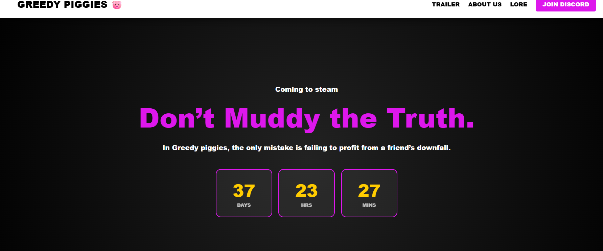
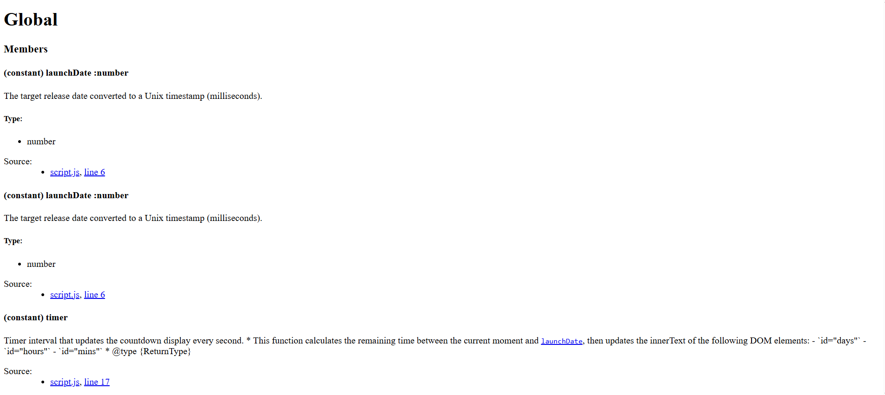
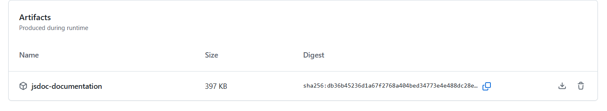

# Design a public-facing API

---

## 1. Introduction (167 words)

I decided to create an API related to the JavaScript used in the social-facing website I developed. Specifically, I chose to document the script that controls the countdown displayed on the main page. This countdown calculates and displays the remaining time until the game is fully released, making it an important feature as it allows visitors to track the launch date and stay engaged with the project.


Rather than rewriting the functionality, my approach was to generate structured API documentation for the existing JavaScript. This would clearly explain the behaviour of the functions, their parameters, and outputs so the system could be more easily understood and reused by other developers.

To achieve this, I researched documentation tools commonly used in industry and identified JSDoc (Use JSDoc: Getting Started with JSDoc 3, s.d.) as the most suitable option. JSDoc allows developers to annotate functions within JavaScript files and automatically generate readable documentation.

 I also researched GitHub build artifacts through a YouTube tutorial (How to upload & download artifacts in Github Actions ( Step-by-Step Guide), 2025), which showed how generated documentation can be packaged and downloaded from a repository workflow.

---

## 2. Implementation (246 words)

The implementation used JavaScript as the core programming language, since the countdown system already existed within the website’s front-end code.
```
 * Timer interval that updates the countdown display every second.
 * * This function calculates the remaining time between the current moment 
 * and {@link launchDate}, then updates the innerText of the following DOM elements:
 * - `id="days"`
 * - `id="hours"`
 * - `id="mins"`
 * * @type {ReturnType<typeof setInterval>}
 */
const timer = setInterval(function() {
    /** @type {number} Current timestamp in milliseconds */
    const now = new Date().getTime();

    /** @type {number} Difference between launch and now in milliseconds */
    const distance = launchDate - now;

    // Time calculations
    /** @type {number} Remaining full days */
    const days = Math.floor(distance / (1000 * 60 * 60 * 24));
    
    /** @type {number} Remaining hours after days are subtracted */
    const hours = Math.floor((distance % (1000 * 60 * 60 * 24)) / (1000 * 60 * 60));
    
    /** @type {number} Remaining minutes after hours are subtracted */
    const minutes = Math.floor((distance % (1000 * 60 * 60)) / (1000 * 60));
 ```

 The documentation system was generated using JSDoc, which works by placing structured comment blocks above functions and variables. These comment blocks describe parameters, return values, and the purpose of each function. After adding these annotations to the countdown script, I used the JSDoc command line tool to generate a formatted HTML documentation site that acts as the API reference (Use JSDoc: Getting Started with JSDoc 3, s.d.).

The main file documented was the JavaScript responsible for calculating and updating the countdown timer. Key functions include those responsible for calculating the remaining time, updating the countdown display, and triggering refresh intervals so the timer updates every second. Each function was annotated with JSDoc tags such as @function, @param, and @returns, allowing the documentation generator to automatically build a structured API page.


To make the generated documentation downloadable, I used GitHub artifacts. Through the repository’s automated workflow system, the documentation files were packaged as an artifact that can be downloaded after a build process. 



 One challenge was ensuring that all functions were correctly documented so the generator would recognise them. This was resolved by carefully following the JSDoc annotation format. Another challenge was making sure the document was seperate from the social facing website HTML since I had a few issues with it replacing the whole website so this is why I chose to have the document downloadable.

---

## 3. Outcome (115 words)
The final result is a documented API that explains how the countdown system used on the website operates. The generated documentation provides a clear overview of the countdown functions, their parameters, and the values they return. This allows other developers to understand how the timer works and potentially reuse or modify it within other projects. The documentation is automatically generated from the annotated JavaScript code, meaning it can easily be updated whenever the script changes.

All of the requirements of the task were met. The countdown script was successfully documented using JSDoc, and the documentation output was generated as a downloadable artifact through GitHub. This ensures the API documentation can be accessed and shared easily.


---

## 4. Bibliography

How to upload & download artifacts in Github Actions ( Step-by-Step Guide) (2025) Directed by DevOps Topics. At: https://www.youtube.com/watch?v=-lRQnb07MeY (Accessed  08/03/2026).

Use JSDoc: Getting Started with JSDoc 3 (s.d.) At: https://jsdoc.app/about-getting-started (Accessed  08/03/2026).


---

## 5. AI Usage Declaration

- State whether AI tools were used or not  
- If used, name the tool(s) and describe how they were used  

---

## Submission Notes & Checklist

> Remove this section once complete — use this as a checklist before submitting

- Total word count: **500 words (±10%)** across Sections 1–3  
- **Figure captions and figure descriptions do NOT count towards the word count**  
- Use **plenty of images, GIFs, videos, screenshots, and short code snippets** where appropriate to demonstrate understanding and functionality  
- All required **source code is included in this repository**  
- Any required **executables or builds are provided via GitHub Releases**, where appropriate  
- Demonstration video link is accessible and clearly shows functionality  
- Bibliography includes all referenced material  
- AI usage is clearly declared (or explicitly stated as not used)  
- Work reflects your own understanding and professional practice  

---
