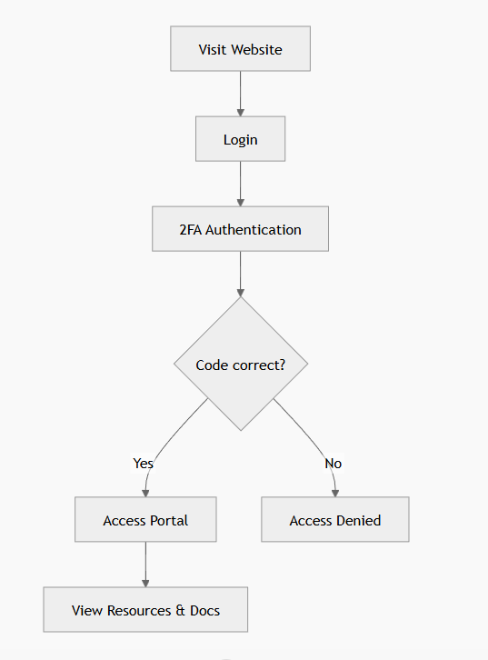
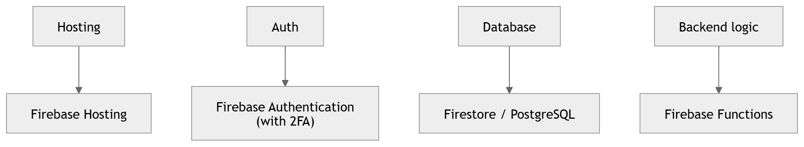

# Short proposal

## Explanation of the tool 

I made a resource portal for this project to support clearer collaboration, reduce confusion or miscommunication, and improve workflow efficiency by providing structured documentation that aligns with professional production practices. I did this by including clear points of contacts next to each important document linked on the website and also provided explanations on how all of the discord bots worked.  

***Figure 1.** Point of contact for each document made and the links to each document.*
 
---
## The technical stack needed to support it in production
Hosting a website like this online which contains sensitive data such as peoples names and editable links means that two factor authentication should be in place. Keeping this in mind, it would be best to host the website on a platform called Firebase (Firebase | Google’s Mobile and Web App Development Platform, s.d.). 

Firebase allows you to host your website (Firebase Hosting, s.d.), provides two factor authentication, file storage, database and backend functions. This platform is most beneficial to use as the site is mainly front end based so it would be enough as there is no complex backend logic involved. It is also quick to setup and doesnt involve managing any servers which would be uneccessary for this portal. 

***Figure 2.** Firebase flow and using two factor authentication.*

***Figure 3.** Example of technical stack using firebase.*

---
## The hardware and/or cloud requirements needed to run, host, test, or maintain it
The website would mainly rely on cloud services rather than a dedicated physical server to store any data. 

Cloud Firestore (Firestore, s.d.) would be used to store the document links, contact details and the portal content. However, if there are any uploaded files put onto the website instead of the links then cloud storage for Firebase would be needed to take into consideration. 

Firebase Hosting includes SSL and custom domain support, and hosting usage is mainly measured by storage and data transfer. Cloud Firestore usage is measured by stored data plus document reads, writes, and deletes.

The website wouldnt require any server hardware but it would still require a developer to maintain and test the website itself. Since it wouldnt make sense for the website to be accessed from users phones it would only need to be tested on a computer/PC. 

---
## Ongoing costs 
The cost of hosting the website depends on if there are files being stored on the website since it would require storage plans. There is a free allowance on Firebase but past that you are charged 15p per GB. There is also a payment plan for how many people can use the authentication but if this was used in a smaller team then that wouldn't impact the website since its up to 3,000 daily active users. 

Since this website would likely be for an indie team the overall costs would be next to nothing since it wouldnt require any payment plans as it wouldnt go over the free allowance limit. 

If the portal only stores links to documents hosted elsewhere, production costs stay lower and the system remains simpler. If the portal stores uploaded PDFs, images, or files directly in Firebase Storage, then the project would need to use the Blaze pay-as-you-go plan to maintain Cloud Storage access. This makes sense because a resource portal needs to be accessible quickly from office PCs and home laptops without requiring a seperate app. 

---
## Target platforms 
The target platform would be web with support for desktop. In a production environment, the portal should be tested on Windows and macOS desktop browsers. 

---

## 4. Bibliography

Firebase | Google’s Mobile and Web App Development Platform (s.d.) At: https://firebase.google.com/?utm_source=google&utm_medium=cpc&utm_campaign=Cloud-SS-DR-Firebase-FY26-global-gsem-1713590&utm_content=text-ad&utm_term=KW_firebase&gclsrc=aw.ds&gad_source=1&gad_campaignid=23417478209&gbraid=0AAAAADpUDOiKhNQ39WroIvpMRJ-GmwgpN&gclid=Cj0KCQjwj47OBhCmARIsAF5wUEFdeBzP2_FS31255g22Nffu1n19i55oRUdsDP9RucjCVwsqMAkA7xIaAuEbEALw_wcB (Accessed  25/03/2026).

Firebase Hosting (s.d.) At: https://firebase.google.com/docs/hosting (Accessed  25/03/2026).

Firestore (s.d.) At: https://cloud.google.com/products/firestore (Accessed  25/03/2026).

---

## 5. AI Usage Declaration

> The following assets were created or modified with the use of Gemini:
> * Mermaid diagrams
> * Resource portal 

